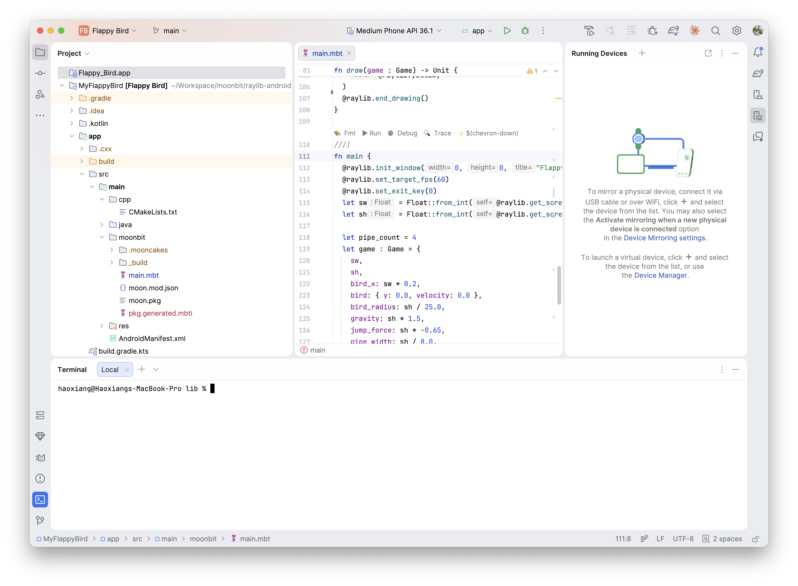
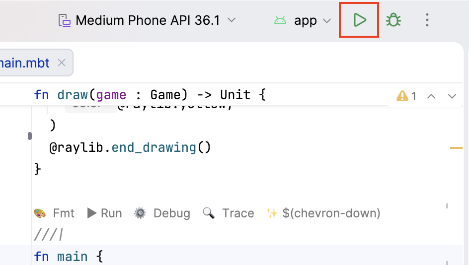

# Build an Android Game with MoonBit and Raylib

[MoonBit](https://www.moonbitlang.com/) compiles to native code (via C) with a strong type system and familiar syntax. [Raylib](https://www.raylib.com/) is a minimal C library for games -- window, drawing, input, and audio with zero boilerplate. Together, they let you build Android games with native performance and a tiny APK -- no engine runtime, no garbage collector pauses. In this tutorial, you'll go from zero to a working Flappy Bird on your phone.

Because MoonBit compiles to standard C code, the same game code can target multiple platforms by swapping the compilation toolchain: gcc or clang for desktop, emcc (Emscripten) to WebAssembly for browsers, or the Android NDK to cross-compile into a native `.so` shared library packaged into an APK. The core game logic requires no per-platform rewrites -- though mobile targets like Android may need minor input adaptations, such as replacing keyboard events with touch gesture detection.

## Prerequisites

Before we start, make sure you have:

- **MoonBit toolchain** -- install the `moon` CLI from [moonbitlang.com/download](https://www.moonbitlang.com/download/)
- **Android SDK + NDK** -- the easiest way is to install [Android Studio](https://developer.android.com/studio), which bundles both. Make sure NDK is installed (Android Studio > Settings > SDK Manager > SDK Tools > NDK)
- **An Android device** (or emulator) with USB debugging enabled. If you installed Android Studio with the recommended settings, it comes with an emulator ready to use.
- **ADB** on your PATH (comes with Android SDK platform-tools) -- only needed if you prefer building and deploying from the command line instead of Android Studio

Then install the scaffolding tool:

```bash
moon install tonyfettes/create-moonbit-raylib-android-app
```

This gives you the `create-moonbit-raylib-android-app` command, which generates a complete project ready to build.

## Scaffold a New Project

Run the scaffolding tool to create a new project:

```bash
create-moonbit-raylib-android-app MyFlappyBird
```

This generates a complete Android project:

```plaintext
MyFlappyBird/
├── gradlew                          # Gradle build wrapper
├── settings.gradle.kts
├── app/
│   ├── build.gradle.kts             # Android build config (NDK, ABI targets)
│   ├── src/main/
│   │   ├── AndroidManifest.xml      # App manifest (NativeActivity)
│   │   ├── java/.../MainActivity.kt # Thin Kotlin entry point
│   │   ├── moonbit/                 # YOUR GAME CODE LIVES HERE
│   │   │   ├── main.mbt            # Starter game
│   │   │   ├── moon.mod.json       # MoonBit module config
│   │   │   └── moon.pkg            # Package declaration
│   │   └── cpp/
│   │       └── CMakeLists.txt       # Build pipeline glue
│   └── ...
└── gradle/
```

You can also open the project in Android Studio (click **Open** from the welcome screen). Switch to **Project** view to see the `moonbit/` folder where your game code lives.



The scaffolding already configures the Raylib dependency in `moon.mod.json` and imports it in `moon.pkg` -- you don't need to touch either file. The generated `main.mbt` is a hello world that displays centered text.

## Build and Deploy

Building the project compiles your MoonBit code to C, then uses the Android NDK to compile everything into a native shared library packaged into an APK.

```bash
cd MyFlappyBird
./gradlew assembleDebug --no-daemon
```

The first build takes a few minutes (it compiles Raylib from source). Subsequent builds are much faster.

If you opened the project in Android Studio, you can build and run in one step -- select your device or emulator from the toolbar and click the **Run** button (green play triangle).



Or from the command line, install and launch on your device:

```bash
adb install -r app/build/outputs/apk/debug/app-debug.apk
adb shell am start -n com.example.myflappybird/com.example.myflappybird.MainActivity
```

Either way, you should see "Hello, World!" displayed on screen.

## Make It Your Own: Flappy Bird

Every game follows the same core loop: **initialize** (create window, set up state), **loop** (update state from input, draw everything), **cleanup** (close window). Let's build a complete Flappy Bird clone. Replace `app/src/main/moonbit/main.mbt` with the code below -- we'll go through it piece by piece.

### Data Model

Three structs hold the entire game state:

```moonbit
///|
priv struct Bird {
  mut y : Float
  mut velocity : Float
}

///|
priv struct Pipe {
  mut x : Float
  mut gap_y : Float
  mut scored : Bool
}

///|
priv struct Game {
  sw : Float
  sh : Float
  bird_x : Float
  bird : Bird
  bird_radius : Float
  gravity : Float
  jump_force : Float
  pipes : Array[Pipe]
  pipe_width : Float
  gap_size : Float
  pipe_speed : Float
  pipe_spacing : Float
  mut score : Int
  mut game_over : Bool
}
```

`Bird` holds dynamic state (position and velocity). `Pipe` tracks each obstacle's position, gap center, and whether it's been scored. Constants like `bird_x` and `bird_radius` live in `Game`. All sizes derive from screen dimensions (`sw`, `sh`) so the game scales to any device.

### Entity Behaviors

Each entity gets methods for its core behaviors. The `fn Bird::method(self : Bird, ...)` syntax lets us call these as `game.bird.method(...)` later.

`Bird` can reset, update its physics, and draw itself. `Bird::update` returns `true` if the bird hits the ceiling or floor:

```moonbit
///|
fn Bird::reset(self : Bird, sh : Float) -> Unit {
  self.y = sh / 2.0
  self.velocity = 0.0
}

///|
fn Bird::update(
  self : Bird,
  gravity : Float,
  radius : Float,
  sh : Float,
  dt : Float,
) -> Bool {
  self.velocity += gravity * dt
  self.y += self.velocity * dt
  // Hit ceiling or floor?
  self.y < radius || self.y > sh - radius
}

///|
fn Bird::draw(self : Bird, x : Float, radius : Float) -> Unit {
  @raylib.draw_circle_v(
    @raylib.Vector2::new(x, self.y),
    radius,
    @raylib.yellow,
  )
}
```

Multiplying by `dt` (seconds since last frame) makes the physics frame-rate independent.

`Pipe` can reset to a new position, draw its top and bottom rectangles, and check for collision with the bird:

```moonbit
///|
fn Pipe::reset(self : Pipe, x : Float, game : Game) -> Unit {
  self.x = x
  self.gap_y = random_gap_y(game)
  self.scored = false
}

///|
fn Pipe::draw(self : Pipe, width : Float, gap_size : Float) -> Unit {
  let px = self.x.to_int()
  let pw = width.to_int()
  let gap_top = (self.gap_y - gap_size / 2.0).to_int()
  let gap_bottom = (self.gap_y + gap_size / 2.0).to_int()
  @raylib.draw_rectangle(px, 0, pw, gap_top, @raylib.darkgreen)
  @raylib.draw_rectangle(
    px,
    gap_bottom,
    pw,
    @raylib.get_screen_height() - gap_bottom,
    @raylib.darkgreen,
  )
}

///|
fn Pipe::collides_with(
  self : Pipe,
  bird_x : Float,
  bird_y : Float,
  bird_radius : Float,
  pipe_width : Float,
  gap_size : Float,
) -> Bool {
  // Horizontal overlap and outside the gap = hit
  bird_x + bird_radius > self.x &&
  bird_x - bird_radius < self.x + pipe_width &&
  (bird_y - bird_radius < self.gap_y - gap_size / 2.0 ||
  bird_y + bird_radius > self.gap_y + gap_size / 2.0)
}
```

We also need a helper to generate random gap positions within safe bounds:

```moonbit
///|
fn random_gap_y(game : Game) -> Float {
  Float::from_int(
    @raylib.get_random_value(
      (game.gap_size / 2.0 + 50.0).to_int(),
      (game.sh - game.gap_size / 2.0 - 50.0).to_int(),
    ),
  )
}
```

### Game Logic

With entity behaviors defined, the top-level functions orchestrate them. `reset` initializes the bird and spaces pipes evenly off-screen to the right:

```moonbit
///|
fn reset(game : Game) -> Unit {
  game.bird.reset(game.sh)
  game.score = 0
  game.game_over = false
  for i in 0..<game.pipes.length() {
    game.pipes[i].reset(game.sw + Float::from_int(i) * game.pipe_spacing, game)
  }
}
```

`update` handles input, physics, pipe scrolling, collision, and scoring. `is_gesture_detected(GestureTap)` responds to both touchscreen taps and mouse clicks, so you can test on desktop too. When a pipe scrolls off the left edge, it wraps to the right with a new random gap -- creating infinite scrolling with just 4 objects:

```moonbit
///|
fn update(game : Game, dt : Float) -> Unit {
  if game.game_over {
    if @raylib.is_gesture_detected(@raylib.GestureTap) {
      reset(game)
    }
    return
  }

  if @raylib.is_gesture_detected(@raylib.GestureTap) {
    game.bird.velocity = game.jump_force
  }

  // Bird physics; boundary hit = game over
  if game.bird.update(game.gravity, game.bird_radius, game.sh, dt) {
    game.game_over = true
  }

  // Move pipes, check collision and scoring
  for pipe in game.pipes {
    pipe.x -= game.pipe_speed * dt
    if pipe.x < -game.pipe_width {
      pipe.reset(
        pipe.x + Float::from_int(game.pipes.length()) * game.pipe_spacing,
        game,
      )
    }

    if pipe.collides_with(
      game.bird_x,
      game.bird.y,
      game.bird_radius,
      game.pipe_width,
      game.gap_size,
    ) {
      game.game_over = true
    }

    // Score when bird passes a pipe
    if not(pipe.scored) && pipe.x + game.pipe_width < game.bird_x {
      game.score += 1
      pipe.scored = true
    }
  }
}
```

`draw` renders everything each frame. All Raylib draw calls must be between `begin_drawing()` and `end_drawing()`. Pipes are drawn before the bird so they render behind it. `draw_centered_text` is a small helper since we center text in three places (`"\{game.score}"` is MoonBit's string interpolation):

```moonbit
///|
fn draw_centered_text(
  text : String,
  y : Int,
  size : Int,
  color : @raylib.Color,
) -> Unit {
  @raylib.draw_text(
    text,
    (@raylib.get_screen_width() - @raylib.measure_text(text, size)) / 2,
    y,
    size,
    color,
  )
}

///|
fn draw(game : Game) -> Unit {
  @raylib.begin_drawing()
  @raylib.clear_background(@raylib.skyblue)
  for pipe in game.pipes {
    pipe.draw(game.pipe_width, game.gap_size)
  }
  game.bird.draw(game.bird_x, game.bird_radius)
  draw_centered_text(
    "\{game.score}", (game.sh * 0.05).to_int(),
    (game.sh / 10.0).to_int(), @raylib.white,
  )
  if game.game_over {
    let over_size = (game.sh / 12.0).to_int()
    draw_centered_text(
      "GAME OVER", (@raylib.get_screen_height() - over_size) / 2,
      over_size, @raylib.red,
    )
    draw_centered_text(
      "Tap to restart", @raylib.get_screen_height() / 2 + over_size / 2 + 10,
      (game.sh / 25.0).to_int(), @raylib.gray,
    )
  }
  @raylib.end_drawing()
}
```

### Main

`main` ties everything together. `init_window(0, 0, ...)` makes the window fill the screen. The game loop is three lines: get delta time, update, draw:

```moonbit
///|
fn main {
  @raylib.init_window(0, 0, "Flappy Bird")
  @raylib.set_target_fps(60)
  @raylib.set_exit_key(0)
  let sw = Float::from_int(@raylib.get_screen_width())
  let sh = Float::from_int(@raylib.get_screen_height())
  let pipe_count = 4

  let game : Game = {
    sw,
    sh,
    bird_x: sw * 0.2,
    bird: { y: 0.0, velocity: 0.0 },
    bird_radius: sh / 25.0,
    gravity: sh * 1.5,
    jump_force: sh * -0.65,
    pipe_width: sh / 8.0,
    gap_size: sh / 4.0,
    pipe_speed: sw / 6.0,
    pipe_spacing: sw / 3.0,
    pipes: Array::makei(pipe_count, fn(_) {
      { x: 0.0, gap_y: 0.0, scored: false }
    }),
    score: 0,
    game_over: false,
  }
  reset(game)

  while not(@raylib.window_should_close()) {
    let dt = @raylib.get_frame_time()
    update(game, dt)
    draw(game)
  }
  @raylib.close_window()
}
```

Build and deploy to see the complete game:

```bash
./gradlew assembleDebug --no-daemon
adb install -r app/build/outputs/apk/debug/app-debug.apk
```


## Where to Go Next

This tutorial covered the basics, but MoonBit + Raylib can handle much more complex games. Here are some directions to explore:

- **Raylib binding** -- the [tonyfettes/raylib](https://mooncakes.io/docs/#/tonyfettes/raylib/) package provides MoonBit bindings for Raylib, covering shapes, textures, audio, 3D models, shaders, and more.
- **Selene** -- an [experimental game engine](https://github.com/moonbit-community/selene) built in MoonBit with both Canvas2D and Raylib backends, designed for building web and native games.
- **MoonBit documentation** -- learn more about the language at [docs.moonbitlang.com](https://docs.moonbitlang.com/).

The combination of MoonBit's native compilation, Raylib's simplicity, and the scaffolding tool's one-command setup makes this one of the most straightforward ways to build native Android games from scratch. No engine. No runtime. Just code.
