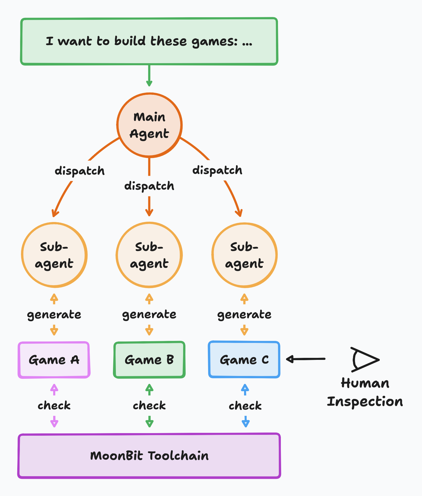
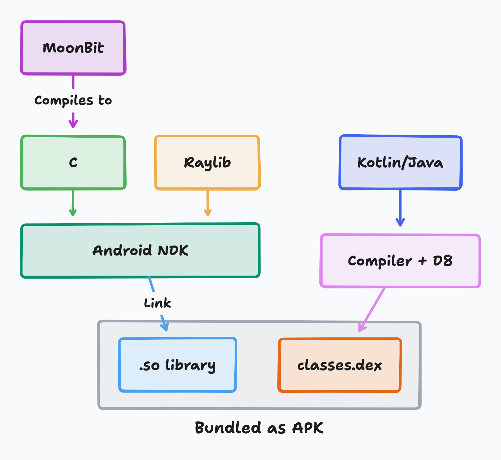
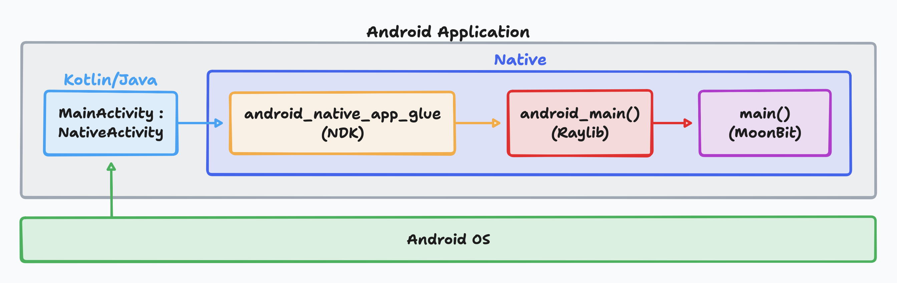
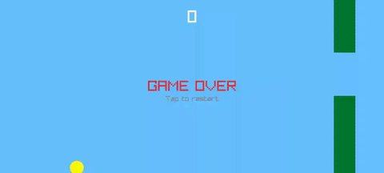

# MoonBit AI Software Factory Mass-Produces 150+ Cross-Platform Games

## From Compiler to Games: Validating the Factory's Breadth

Previously, the MoonBit team demonstrated the AI software factory's **depth**: an AI Agent generated a 35,000-line C compiler from scratch in 10 days ([Fastcc.mbt](https://github.com/moonbit-community/fastcc)), capable of compiling tcc, QuickJS, and SQLite while passing their respective test suites, with compilation speed 4x faster than `clang -O0`.

This raises a question: is this capability a one-off feat for a single heavyweight project, or a general-purpose capacity that can be replicated at scale?

We answered with an experiment: almost 100% AI batch-produced 150 games, spanning genres from Space Trader to Wuxia Rooftop Duel, from Tower Defense Frontier to Pinball Workshop — covering shooters, strategy, action, puzzle, and more.

Here are the results:

- **All playable**: every game has a complete game loop, collision detection, scoring system, and touch support — all crash-free
- **Zero segfaults** — not a single game crashed due to memory errors
- **Three-platform deployment** — the same code runs on desktop (gcc/clang), Web (emcc → WASM), and Android (NDK). The Raylib MoonBit bindings themselves were also AI-generated

Download the games: <https://moonbit-community.github.io/tonyfettes-raylib-android-games>

## The Production Process: Building Software Like a Factory

### Parallel Production: The Subagent Pipeline

Traditional AI programming is one-to-one: a developer sits in front of an IDE, talks to an AI assistant, and works on one project at a time. Under this model, 150 games means 150 independent development sessions — even at 30 minutes each, that's 75 hours.

The software factory works differently. We leveraged the AI Agent's **subagent** mechanism to parallelize game production: the main Agent receives a batch of game concepts (space trading, tower defense, pinball...), then spawns multiple subagents, each independently responsible for generating a complete game. These subagents work simultaneously, each writing code, invoking the compiler, and fixing errors on their own.



This is the core distinction between a "factory" and a "workshop": **production capacity is no longer limited by a single Agent's serial speed, but by how many production lines you can run in parallel**.

Each subagent follows the same workflow:

1. Receive a game concept description (e.g., "a space trading simulation game")
2. Generate complete MoonBit game code
3. Invoke `moon check` / `moon build` to compile, receive type error feedback
4. Fix code based on compiler errors, loop until compilation succeeds
5. Verify the game launches without crashing

Throughout this process, the human's role is that of a **factory operator**: defining what to produce (the list of game concepts), starting the production lines (dispatching subagents), and spot-checking output quality (playtesting a few games). There's no need to review every line of code — with 150 games of several hundred lines each, line-by-line auditing is neither practical nor necessary. Code quality is guaranteed by the compiler's type system and the runtime's zero-crash record.

### From Desktop to Three Platforms: Progressive Porting

The 150 games weren't generated on all three platforms at once — they followed a progressive factory pipeline:

**Phase 1: Desktop game production.** Subagents generate 150+ desktop games in parallel, run directly with the MoonBit toolchain. The acceptance criterion: compiles successfully, launches without crashing. Random spot-checks revealed that most were fully playable.

**Phase 2: Web porting.** Because MoonBit compiles to standard C code, porting from desktop to Web is nearly free — replacing gcc with emcc (Emscripten) compiles the same C code to WASM, running in the browser. The game logic code itself requires zero modifications.

Link: <https://bobzhang.github.io/raylib-moonbit-web-games/>

**Phase 3: Android porting.** The C code is cross-compiled into `.so` shared libraries via Android NDK and packaged into APKs. This step leverages a scaffolding tool that auto-generates Gradle configuration and a Kotlin entry point — the AI Agent only needs to place the game code into the correct directory structure.

Link: <https://moonbit-community.github.io/tonyfettes-raylib-android-games/>

**Phase 4: Touch adaptation.** After Android porting, manual spot-checks revealed that some games only supported keyboard input — understandably, since they were originally generated for desktop. AI Agents were dispatched again to batch-add touch support. Raylib's `is_gesture_detected(GestureTap)` responds to both touchscreen taps and mouse clicks, so touch adaptation typically only requires replacing keyboard events with gesture detection — no game logic rewrite needed.

This progressive pipeline reveals an important property of the software factory: **production isn't one-shot, but can iterate incrementally on existing outputs**. First produce desktop versions to validate core logic; then port to Web and Android to expand distribution; finally do platform-specific adaptations. Each phase builds incrementally on the previous one, rather than starting over.

## How This Is Possible: From 60% to 100%

### Three Critical Completion Milestones

Generating code with AI isn't hard — making that code **actually work** is. In software factory practice, we've observed three critical completion milestones:

- **60%**: The AI generates text that "looks like code" but can't compile. Interfaces between modules don't match, types are inconsistent, function signatures don't line up. Cursor's AI-generated 3-million-line browser stalled at this milestone — massive code volume, but zero functionality because nothing compiled.
- **90%**: Code compiles and runs but has logic errors, missed edge cases, or platform compatibility issues. A game launches but crashes on certain inputs, or behaves inconsistently across devices.
- **100%**: Code runs stably on all target platforms with correct logic and complete user experience.

The MoonBit software factory's core capability is pushing AI output from 60% to 100%.

### From 60% to 90%: The Type System as Quality Gate

Most AI coding tools stall at 60% because the AI generates code that "looks right" but has structural errors, and the programming language doesn't provide strong enough compile-time checks to catch them.

Python and JavaScript have no compile-time checking — errors only surface at runtime. C/C++ have compile-time checks but the type system is too weak — implicit type conversions, pointer arithmetic, and undefined behavior are all error sources the compiler can't intercept.

MoonBit's design is fundamentally different. A strong type system + pattern matching + no implicit conversions means every line of AI-generated code must pass strict compiler checks:

- **Type mismatch**: passed an `Int` where the function expects `Float` — compile error
- **Missing branches**: `match` expression doesn't cover all cases — compile warning
- **Uninitialized fields**: struct construction missing a field — compile error
- **No implicit conversions**: no JavaScript-style `"1" + 1 = "11"` surprises

This means that during the batch production of 150 games, even when humans can't review every line, the compiler automatically intercepts structural errors. Each AI Agent gets immediate, unambiguous feedback on every compilation and corrects accordingly — this loop executes automatically within each subagent, requiring no human intervention.

This is the fundamental reason for zero segfaults across 150 games: **unsafe code simply cannot pass compilation**.

### From 90% to 100%: Compilation Speed and the Feedback Loop

Code that compiles doesn't mean code that's correct. The leap from 90% to 100% depends on a fast **verification feedback loop**: AI modifies code → compiles → runs tests → observes results → modifies again. The faster this loop executes, the more effectively the AI converges on a correct implementation.

In the context of batch-producing 150 games, the importance of compilation speed is amplified tenfold. An AI might run thousands of compilations per day — if each compilation takes 30 seconds (as with Rust), a thousand runs means 8 hours of pure waiting; MoonBit's compilation speed is 10 to 100x faster than Rust, meaning the same number of iterations takes only minutes.

**Compilation speed isn't a minor developer experience optimization — it's the software factory's throughput bottleneck**. When production scales from 1 project to 150, every millisecond of compilation time difference is amplified into a perceptible capacity gap.

## Compiling to C: The Factory's Cross-Platform Secret

MoonBit compiles to standard C code — this design decision is the key to cross-platform scalability.

### One Codebase, Three Platforms

The same AI-generated MoonBit code:

- Compiles with **gcc/clang** to run on desktop
- Compiles with **emcc** to WASM to run in browsers
- Cross-compiles with **Android NDK** to `.so` to run on phones

No per-platform code rewrites, no platform-specific adaptation layers. The AI generates once, and the factory's build pipeline turns it into executables for three platforms. This is why 150 games can simultaneously span three platforms — **the factory's reuse power comes from the portability of its compilation target**.

### Full-Chain AI Generation

Worth emphasizing: not only the game code, but also the infrastructure — the Raylib MoonBit bindings ([tonyfettes/raylib](https://mooncakes.io/docs/tonyfettes/raylib/)) — was AI-generated. From low-level bindings to application code, the entire chain is a software factory output. The fact that infrastructure itself can be factory-produced represents a bootstrapping form of capability accumulation.

### Build Pipeline



From MoonBit source to an APK on the phone, the pipeline is deterministic:

1. **MoonBit → C**: The MoonBit compiler translates `.mbt` source files into standard C code
2. **C → .so**: The Android NDK cross-compiler compiles the C code along with Raylib sources into a shared library
3. **Package APK**: Gradle packages the `.so` into an APK

The MoonBit ecosystem provides a scaffolding tool that generates a complete Android project in one command:

```bash
moon install tonyfettes/create-moonbit-raylib-android-app
create-moonbit-raylib-android-app MyFlappyBird
```

In the generated project, the AI Agent only needs to touch one directory: **`app/src/main/moonbit/`**. Gradle configuration, CMake build, and the Kotlin entry point are all handled by the scaffolding. Building and deploying is also a single command:

```bash
cd MyFlappyBird && ./gradlew assembleDebug --no-daemon
```



At runtime, the lightweight `MainActivity` loads the `.so` library, the NDK glue code bootstraps the native side, Raylib initializes the OpenGL ES context, and calls `main()` — the C function compiled from MoonBit's `fn main`.

## Anatomy of a Factory Output: Flappy Bird

Let's open one of the 150 factory outputs — Flappy Bird — and examine the AI-generated code.

The AI split the game state into three structs — `Bird` (dynamic state), `Pipe` (obstacles), and `Game` (global container):

```moonbit
///|
priv struct Bird {
  mut y : Float
  mut velocity : Float
}

///|
priv struct Pipe {
  mut x : Float
  mut gap_y : Float
  mut scored : Bool
}

///|
priv struct Game {
  sw : Float
  sh : Float
  bird_x : Float
  bird : Bird
  bird_radius : Float
  gravity : Float
  jump_force : Float
  pipes : Array[Pipe]
  pipe_width : Float
  gap_size : Float
  pipe_speed : Float
  pipe_spacing : Float
  mut score : Int
  mut game_over : Bool
}
```

Notable design decisions — all made autonomously by the AI: minimized mutable state (`Bird` has only two `mut` fields); all sizes derived from screen dimensions (adapts to any resolution); only 4 `Pipe` objects for infinite scrolling (pipes that exit the left edge get their coordinates reset to the right).

The core `update` function contains physics simulation, collision detection, and scoring logic:

```moonbit
///|
fn update(game : Game, dt : Float) -> Unit {
  if game.game_over {
    if @raylib.is_gesture_detected(@raylib.GestureTap) {
      reset(game)
    }
    return
  }

  if @raylib.is_gesture_detected(@raylib.GestureTap) {
    game.bird.velocity = game.jump_force
  }
  game.bird.velocity += game.gravity * dt
  game.bird.y += game.bird.velocity * dt

  if game.bird.y < game.bird_radius || game.bird.y > game.sh - game.bird_radius {
    game.game_over = true
  }

  for pipe in game.pipes {
    pipe.x -= game.pipe_speed * dt
    if pipe.x < -game.pipe_width {
      pipe.x += Float::from_int(game.pipes.length()) * game.pipe_spacing
      pipe.gap_y = random_gap_y(game)
      pipe.scored = false
    }

    // AABB collision detection
    if game.bird_x + game.bird_radius > pipe.x &&
      game.bird_x - game.bird_radius < pipe.x + game.pipe_width {
      if game.bird.y - game.bird_radius < pipe.gap_y - game.gap_size / 2.0 ||
        game.bird.y + game.bird_radius > pipe.gap_y + game.gap_size / 2.0 {
        game.game_over = true
      }
    }

    if not(pipe.scored) && pipe.x + game.pipe_width < game.bird_x {
      game.score += 1
      pipe.scored = true
    }
  }
}
```

All motion values are multiplied by `dt` (frame-rate independent physics); `is_gesture_detected(GestureTap)` responds to both touchscreen and mouse — the same code ports from desktop to mobile with no game logic changes.

The complete Flappy Bird — gravity, pipes, collision, scoring, game over, and restart — in roughly 200 lines of code. AI-generated, immediately playable.



## Conclusion

From a C compiler (35,000 lines, 10 days) to 150+ games (parallel subagent production, three-platform deployment), the MoonBit AI software factory demonstrates two complementary capabilities:

- **Depth**: AI can complete complex systems under rigorous engineering constraints (compilers, PDF tools, Wasm virtual machines)
- **Breadth**: The same factory infrastructure can scale to mass production — 150 games, 100% AI-generated code, zero crashes

The key isn't that a particular AI model is especially powerful, but that MoonBit provides an engineering infrastructure that enables AI to work reliably:

1. **AI-native language design** — a strong type system intercepts errors at compile time, giving AI immediate, structured feedback on every generation
2. **Compile-to-C portability** — one codebase automatically targets desktop, Web, and Android
3. **Blazing-fast compilation** — AI can execute massive compile-fix cycles in short timeframes, converging quickly on correct implementations
4. **Programmable toolchain** — scaffolding, build systems, and IDE tools are all programmatically callable by Agents, forming an automated production pipeline

When Cursor generated 3 million lines of browser code that couldn't compile, MoonBit's 150 games all passed compilation and all ran successfully. The difference isn't the AI model — it's the factory infrastructure.

The significance of the software factory goes beyond "AI can write code." It's about turning software production into a **repeatable, verifiable, scalable pipeline**. Humans define requirements and direction; AI completes the construction and iteration under engineering constraints. From compilers to games, this pipeline is already running.

- [tonyfettes/raylib](https://mooncakes.io/docs/tonyfettes/raylib/) — MoonBit's Raylib bindings (AI-generated)
- [Selene](https://github.com/moonbit-community/selene) — An experimental MoonBit game engine with Canvas2D and Raylib backends
- [MoonBit documentation](https://docs.moonbitlang.com/) — Language reference
